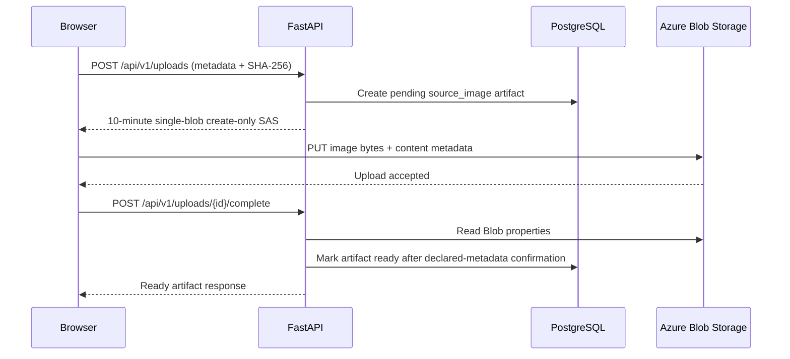

# Image to LEGO

Image to LEGO is a university capstone project for turning a source image into an inspectable, downloadable LEGO model. The intended system combines authenticated project management, AI-assisted image-to-3D reconstruction, asynchronous geometry conversion, artifact storage, and a browser-based 3D experience.

## Current implementation status

This repository currently contains the production-oriented foundation plus the first
authenticated application slices:

- a FastAPI application with root and versioned health endpoints;
- explicit service, repository, and reconstruction-provider boundaries;
- a deterministic fake reconstruction provider for tests;
- Supabase Auth sign-up/sign-in for email/password, Google, and GitHub plus sign-out;
- a verified `GET /api/v1/profile` profile endpoint;
- authenticated project creation/listing through PostgreSQL;
- pending/ready source-image metadata with owner-scoped RLS;
- direct browser-to-Azure Blob upload using a short-lived, single-blob SAS;
- server-side confirmation of Blob existence, size, content type, and client-declared SHA-256 metadata;
- a rolling 30-upload initiation quota over the preceding 24 hours;
- Supabase PostgreSQL migrations with row-level security enabled;
- backend and frontend unit tests, linting, type checking, Docker, and CI configuration; and
- architecture decisions and deployment planning documentation.

Reconstruction jobs, generation/conversion queues and workers, fal.ai/TRELLIS integration,
mesh-to-LEGO conversion, browser 3D inspection, stale-upload cleanup, and production deployment
are **not implemented yet**. No Supabase Storage is used; Azure Blob Storage is the artifact
store.

## Intended architecture

The application is a pragmatic modular monolith with independently runnable API and worker processes. HTTP routes call services; services coordinate purpose-specific repositories and provider abstractions; only those boundary modules communicate with infrastructure. CPU-intensive or long-running work belongs in the worker and must not run in FastAPI request handlers or `BackgroundTasks`.

The future request flow is:

1. React authenticates a user with Supabase Auth and calls the REST API.
2. FastAPI stores relational metadata in Supabase PostgreSQL and binary artifacts in Azure Blob Storage.
3. A reconstruction provider adapter submits image-to-3D work to fal.ai/TRELLIS without leaking provider response schemas into business logic.
4. Azure Service Bus durably delivers conversion jobs to an idempotent Python worker.
5. The worker writes LDraw, BOM, and viewable model artifacts to Blob Storage while the API exposes progress metadata.

See [Architecture](docs/architecture/README.md) for the component diagram and boundary details.

## Implemented source-image upload flow

The API accepts metadata only; image bytes never pass through FastAPI.



PostgreSQL stores ownership, lifecycle, MIME type, byte size, client-declared SHA-256, and the
canonical Blob name. Azure Blob Storage stores the private binary image. SAS URLs are returned to
the browser when needed and are never persisted. `ready` means the direct upload is present with
the expected declared metadata and is ready for downstream server-side validation; it does not mean
FastAPI has cryptographically verified the stored bytes. Before any paid fal submission, the future
generation worker must validate the actual stored source bytes, including content type, resource
bounds, and a recomputed SHA-256.

## Repository layout

```text
backend/              FastAPI application, worker entry point, and Python tests
frontend/             React, TypeScript, Vite application and tests
supabase/             Local Supabase configuration and SQL migrations
docs/architecture/    System architecture documentation
docs/decisions/       Architecture decision records (ADRs)
docs/deployment/      Future Azure CI/CD plan
docs/testing/         Test strategy and isolation rules
infra/                Reserved documentation boundary for reviewed IaC
.github/workflows/    Continuous integration
```

## Prerequisites

- Python 3.12
- [uv](https://docs.astral.sh/uv/)
- Node.js 22 and npm
- Docker Desktop or another Docker Engine (optional for image validation)
- Supabase CLI and Docker (optional for local migration validation)

## Local development

Copy the example environment files, then run the API and frontend in separate terminals. Blank integration values are safe during foundation development because no external provider is invoked.

```powershell
Copy-Item backend/.env.example backend/.env
Copy-Item frontend/.env.example frontend/.env
```

### Backend commands

```powershell
Set-Location backend
uv sync
uv run uvicorn app.main:app --reload --host 127.0.0.1 --port 8000
```

OpenAPI is enabled at `http://localhost:8000/docs`; the schema is available at `/openapi.json`.

### Frontend commands

```powershell
Set-Location frontend
npm install
npm run dev
```

The Vite development server listens at `http://localhost:5173` and calls the URL configured by `VITE_API_BASE_URL`.

### Supabase authentication setup

Create a Supabase project, then set `SUPABASE_URL` for the API and `VITE_SUPABASE_URL` plus `VITE_SUPABASE_PUBLISHABLE_KEY` for the frontend. Keep the publishable key in the frontend only; never expose a Supabase service-role key.

The frontend provides `/login` and `/signup` public routes plus a protected `/` route that shows the authenticated profile. Supabase restores the browser session after refresh; unauthenticated requests for `/` redirect to `/login`.

The protected home route also lets the user create/select a project and upload a supported JPEG,
PNG, or WebP image. The browser hashes the image with Web Crypto, uploads directly to Azure, and
asks the API to verify completion.

In Supabase Auth, enable Email and the Google and GitHub providers. Register `https://<project-ref>.supabase.co/auth/v1/callback` as the OAuth callback in the Google and GitHub provider consoles. Configure the frontend URL in Supabase Auth's Site URL and allowed Redirect URLs (for local development, `http://localhost:5173`); add production frontend URLs explicitly when deployed. Email confirmation behavior is controlled by Supabase: when it is enabled, the application asks the user to confirm their address before signing in.

The API independently verifies each browser access token with the project's JWKS, expected issuer, audience, and expiry before serving `GET /api/v1/profile`. This requires Supabase asymmetric signing keys; ES256 is preferred and RS256 is also accepted. The default audience is `authenticated`; set `SUPABASE_JWT_AUDIENCE` if your project uses a different configured audience.

### PostgreSQL API role

Apply all committed migrations, including `20261006010000_upload_lifecycle.sql`. `DATABASE_URL`
must use a dedicated login role that can select/insert/update the `projects` and `artifacts` tables,
is not the table owner, and does not have `BYPASSRLS`. Each repository transaction sets the
verified JWT subject in the transaction-local `app.current_user_id` setting; the migration's RLS
policies use that value and pooled connections cannot retain it after the transaction.

### Azure Blob upload setup

Create a private Blob container and set `AZURE_STORAGE_ACCOUNT_URL` and
`AZURE_STORAGE_CONTAINER`. The API identity must be allowed to request a user-delegation key and
read Blob properties. The user-delegation-key permission must
be assigned at storage-account scope or higher. The simplest built-in assignment is Storage Blob
Data Contributor at the storage-account scope. A narrower split assigns Storage Blob Delegator at
the account and the required Blob data role at the private container. Do not configure an account
key in the application.

Blob access through the generated SAS requires HTTPS. Configure Blob service CORS for each exact
frontend origin: production origins must use HTTPS, while local development may use
`http://localhost:5173`. Allow only methods `PUT` and `OPTIONS` and headers `content-type`,
`x-ms-blob-type`, and `x-ms-meta-sha256`. The SAS lasts 10 minutes by default, targets exactly one
server-generated blob name, and grants create-only permission.

## Testing and quality commands

Backend:

```powershell
Set-Location backend
uv run ruff check .
uv run mypy app
uv run pytest -q
```

Frontend:

```powershell
Set-Location frontend
npm run lint
npm run test -- --run
npm run build
```

Tests use only local fakes and HTTP mocks. They must never contact fal.ai, Supabase, or Azure.

## Docker commands

Build and run the API image from the repository root:

```powershell
docker build -t image-to-lego-api:local backend
docker run --rm -p 8000:8000 image-to-lego-api:local
```

The same image can invoke the future worker entry point:

```powershell
docker run --rm image-to-lego-api:local python -m app.workers.conversion_worker
```

The worker currently exits with a clear informational message because Azure Service Bus and conversion logic are not implemented.

## Environment variables

Never commit real credentials. Root and service-specific `.env.example` files contain safe placeholders.

| Variable | Used by | Purpose |
| --- | --- | --- |
| `APP_ENV` | API/worker | Runtime environment label |
| `DATABASE_URL` | API/worker | Async PostgreSQL connection string |
| `SUPABASE_URL` | API | Supabase project URL for Auth integration |
| `SUPABASE_JWT_AUDIENCE` | API | Expected Supabase JWT audience |
| `AZURE_STORAGE_ACCOUNT_URL` | API/worker | Blob Storage account URL |
| `AZURE_STORAGE_CONTAINER` | API/worker | Artifact container name |
| `UPLOAD_MAX_IMAGE_SIZE_BYTES` | API | Authoritative maximum source-image size |
| `UPLOAD_QUOTA_LIMIT` | API | Initiations allowed in the rolling quota window |
| `UPLOAD_QUOTA_WINDOW_HOURS` | API | Rolling upload quota duration |
| `UPLOAD_PENDING_LIFETIME_HOURS` | API | Pending upload lifetime before expiry |
| `UPLOAD_SAS_LIFETIME_MINUTES` | API | Single-blob upload SAS lifetime |
| `AZURE_SERVICE_BUS_NAMESPACE` | API/worker | Service Bus fully qualified namespace |
| `AZURE_SERVICE_BUS_QUEUE` | API/worker | Durable conversion queue name |
| `FAL_KEY` | API/worker | fal.ai credential for a future provider adapter |
| `CORS_ORIGINS` | API | JSON array of allowed browser origins |
| `VITE_API_BASE_URL` | Web | FastAPI base URL |
| `VITE_SUPABASE_URL` | Web | Supabase URL for browser authentication |
| `VITE_SUPABASE_PUBLISHABLE_KEY` | Web | Supabase browser-safe publishable key |
| `VITE_UPLOAD_MAX_IMAGE_SIZE_BYTES` | Web | Client-side size check; must match the API value |
| `VITE_UPLOAD_MAX_PIXEL_COUNT` | Web | Client-side decoded-image pixel limit; UX/defense in depth only |

## Architecture documentation

- [Architecture overview](docs/architecture/README.md)
- [ADR-001: PostgreSQL managed by Supabase](docs/decisions/ADR-001-postgresql-supabase.md)
- [ADR-002: Python and FastAPI](docs/decisions/ADR-002-python-fastapi.md)
- [ADR-003: REST API](docs/decisions/ADR-003-rest-api.md)
- [ADR-004: Azure cloud platform](docs/decisions/ADR-004-azure-cloud.md)
- [ADR-005: Azure Blob Storage](docs/decisions/ADR-005-azure-blob-storage.md)
- [ADR-006: Modular monolith](docs/decisions/ADR-006-modular-monolith.md)
- [Future Azure CI/CD plan](docs/deployment/azure-cicd-plan.md)
- [Testing strategy](docs/testing/README.md)

## License

Licensed under the existing [MIT License](LICENSE).
