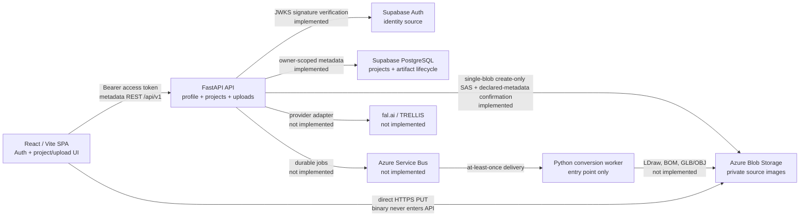

# Intended architecture

Status: **Authenticated profile, project metadata, and direct source-image upload are implemented.
Generation, conversion, and production deployment are not implemented.**



## Dependency boundaries

Runtime dependencies point inward:

```text
API route -> application service -> repository/provider protocol -> infrastructure adapter
```

- Route handlers translate HTTP input/output and remain free of SQL and provider-specific code.
- Services own validation, business rules, and orchestration.
- Purpose-specific repositories isolate PostgreSQL persistence. There is no generic repository base class.
- The reconstruction protocol owns provider-neutral request/status models. A future fal.ai adapter must translate TRELLIS responses at this boundary.
- Binary content belongs in Azure Blob Storage; PostgreSQL stores artifact metadata and blob names only.
- CPU-intensive mesh conversion runs in an independently deployed worker image, never in a request handler or FastAPI `BackgroundTasks`.

## Job delivery and idempotency

Azure Service Bus is the intended durable transport. Delivery will be at least once, so a worker must treat duplicate messages as normal. The database uniqueness constraint on `(project_id, type, idempotency_key)` establishes the first idempotency boundary. A production implementation must also make artifact publication and job-state transitions retry-safe before messages are completed.

## Trust boundaries

Supabase Auth issues browser identities. The SPA uses the Supabase client for email/password and OAuth flows, including browser session persistence and token refresh. FastAPI independently verifies the access token's JWKS signature, issuer, audience, and expiry, and treats the verified `sub` as the current user ID for `GET /api/v1/profile`. Authentication does not differ by sign-in provider. This verification requires Supabase asymmetric signing keys; ES256 is preferred and RS256 is also accepted. All application tables have RLS enabled and intentionally have no permissive browser policies. Production credentials will be supplied at runtime through managed configuration/Key Vault; they must never be embedded in images or frontend bundles.

Project and artifact transactions derive ownership only from the verified JWT `sub`. The API sets
that UUID in the transaction-local `app.current_user_id` PostgreSQL setting, and RLS policies on
`projects` and `artifacts` enforce the same ownership boundary. The API database role must not own
the tables or have `BYPASSRLS`.

## Source-image lifecycle

```mermaid
sequenceDiagram
    participant Browser
    participant API
    participant DB as PostgreSQL
    participant Blob as Azure Blob Storage

    Browser->>API: Upload metadata, size, MIME type, SHA-256, project ID
    API->>DB: Validate owner + rolling quota; insert pending artifact
    API-->>Browser: Single-blob create-only SAS (10 minutes)
    Browser->>Blob: PUT bytes directly with MIME and SHA-256 metadata
    Browser->>API: Complete upload
    API->>Blob: Confirm existence and expected declared properties
    API->>DB: pending -> ready
```

Pending uploads expire after 24 hours by default. This slice represents that expiry in metadata but
does not implement scheduled cleanup. SAS URLs are ephemeral and are not stored in PostgreSQL.
`ready` means the direct upload is present with the expected client-declared metadata and can enter
downstream server-side validation. It does not mean the API has cryptographically verified the Blob
bytes. Before a paid fal submission, the future generation worker must validate the stored source
bytes, including content type, resource bounds, and a recomputed SHA-256. Blob SAS access requires
HTTPS; production browser origins must use HTTPS, while local development may use
`http://localhost:5173` in the Blob CORS allowlist.

