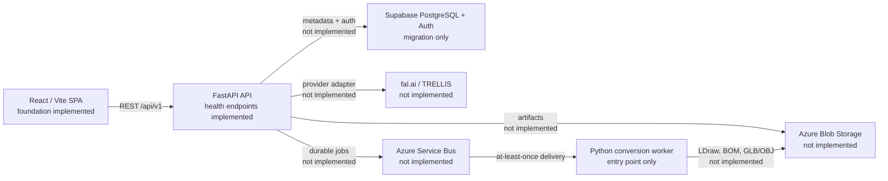

# Intended architecture

Status: **Foundation implemented; production integrations are not implemented.**



## Dependency boundaries

Runtime dependencies point inward:

```text
API route -> application service -> repository/provider protocol -> infrastructure adapter
```

- Route handlers translate HTTP input/output and remain free of SQL and provider-specific code.
- Services own validation, business rules, and orchestration.
- Purpose-specific repositories isolate PostgreSQL persistence. There is no generic repository base class.
- The reconstruction protocol owns provider-neutral request/status models. A future fal.ai adapter must translate TRELLIS responses at this boundary.
- Binary content belongs in Azure Blob Storage; PostgreSQL stores artifact metadata and blob names only.
- CPU-intensive mesh conversion runs in an independently deployed worker image, never in a request handler or FastAPI `BackgroundTasks`.

## Job delivery and idempotency

Azure Service Bus is the intended durable transport. Delivery will be at least once, so a worker must treat duplicate messages as normal. The database uniqueness constraint on `(project_id, type, idempotency_key)` establishes the first idempotency boundary. A production implementation must also make artifact publication and job-state transitions retry-safe before messages are completed.

## Trust boundaries

Supabase Auth will issue user identities, while FastAPI is initially the application data-access boundary. All application tables have RLS enabled and intentionally have no permissive browser policies. Production credentials will be supplied at runtime through managed configuration/Key Vault; they must never be embedded in images or frontend bundles.

