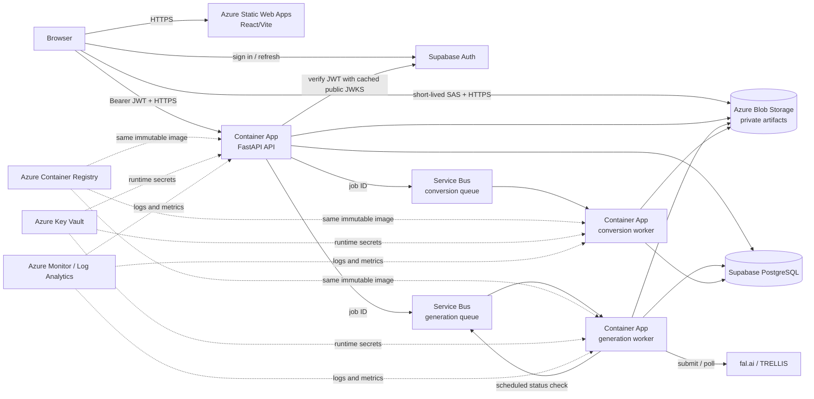

# Azure deployment and CI/CD plan

## Status and scope

This document describes the proposed deployment architecture for the capstone. The application is
not currently deployed by this repository, and no Azure infrastructure is provisioned here yet.

The first deployment has one low-cost development environment only. There is no separate staging or
production environment. Infrastructure-as-code is intentionally deferred; the initial Azure
resources may be created manually, while application releases will be automated through GitHub
Actions. The `infra/` directory remains reserved for reviewed Bicep or Terraform if repeatable
infrastructure provisioning becomes necessary later.

The deployment must preserve the existing modular-monolith design. One backend codebase and one
Docker image are deployed as three independently configured Azure Container Apps:

1. FastAPI API
2. Generation worker: source image -> fal.ai/TRELLIS -> GLB
3. Conversion worker: GLB -> LEGO JSON

These are three deployable processes, not three separate codebases. Separating their deployments
allows HTTP traffic, external-provider work, and CPU-intensive conversion work to scale
independently without introducing Kubernetes or additional application layers.

## Target architecture



The Azure resources should be placed in one resource group and one Container Apps environment. Use
the Azure region closest to the existing Supabase project; Southeast Asia is preferred when the
Supabase project is in Singapore. Keeping data services geographically close reduces latency and
cross-region traffic.

## Proposed Azure resources

| Resource | Proposed tier or mode | Purpose and cost decision |
| --- | --- | --- |
| Azure Container Apps environment | Consumption workload profile | Managed HTTPS, revisions, horizontal scaling, and scale-to-zero without VM or Kubernetes administration. |
| API Container App | 0.5 vCPU, 1 GiB; min 0, max 3 | Public REST API. Start small and raise limits only after measurements show a need. |
| Generation worker Container App | 0.5 vCPU, 1 GiB; min 0, max 2 | I/O-oriented fal.ai submission and status processing, scaled from generation queue depth. |
| Conversion worker Container App | 1 vCPU, 2 GiB; min 0, max 2 | CPU-intensive deterministic conversion, scaled separately from the API and generation worker. |
| Azure Container Registry | Basic | Private storage for the single backend image; suitable for one low-volume development environment. |
| Azure Service Bus | Basic, two queues | Durable point-to-point generation and conversion jobs. Topics and enterprise messaging features are not required. |
| Azure Storage account | General-purpose v2, Hot, ZRS | Private image, GLB, and LEGO JSON artifacts. ZRS provides zone-level storage resilience where supported. |
| Azure Static Web Apps | Free | Builds and distributes the React/Vite static frontend with managed HTTPS. |
| Azure Key Vault | Standard | Stores privileged runtime secrets outside source control and image layers. |
| Azure Monitor and Log Analytics | Consumption-based, bounded retention | Centralized Container Apps logs, platform metrics, dashboards, and alerts. |
| Supabase | Existing Free project | Managed PostgreSQL and Auth; its Free-plan availability and backup limitations are explicitly accepted for the capstone. |

These are starting limits, not performance claims. Load tests and observed memory/CPU usage should
drive any later increase. Maximum replica counts are cost and concurrency controls, particularly for
paid fal.ai work.

## Container Apps configuration

All three Container Apps pull the same git-SHA-tagged image from ACR. They differ only in startup
command, ingress, environment variables, secrets, resources, and scaling rules.

| App | Container command | Ingress | Scaling signal |
| --- | --- | --- | --- |
| API | Docker image default: `uvicorn app.main:app --host 0.0.0.0 --port 8000` | External HTTPS | HTTP concurrency, min 0 and max 3 |
| Generation worker | `python -m app.workers.generation_worker` | Disabled | Generation Service Bus queue depth, min 0 and max 2 |
| Conversion worker | `python -m app.workers.conversion_worker` | Disabled | Conversion Service Bus queue depth, min 0 and max 2 |

The API requires public ingress because the user's browser, hosted by Static Web Apps, calls it
directly. Container Apps supplies the HTTPS endpoint, certificate termination, revision routing, and
load distribution across API replicas; a separate Azure Load Balancer or Application Gateway is not
required for this environment. The workers receive work from Service Bus and expose no public
endpoint.

The API uses `/health` for its startup and liveness checks. Cold starts are accepted because all apps
can scale to zero. For a scheduled demonstration, the team should exercise the end-to-end flow in
advance; temporarily setting the API minimum to one is an operational option only if cold-start delay
is unacceptable and the added cost is approved.

Only the exact deployed Static Web Apps origin is allowed by the API's CORS configuration. Blob CORS
allows the exact frontend origin, `GET`, `PUT`, and `OPTIONS`, and only the headers already required by
the direct-upload flow. The artifact container remains private; browser access uses short-lived,
single-blob SAS URLs issued by the authenticated API.

## Queue delivery and worker resilience

Create separate `generation` and `conversion` queues in one Service Bus Basic namespace. Container
Apps KEDA rules scale each worker from its own active-message count and authenticate using managed
identity. Each worker currently receives one message at a time per replica, so queue depth maps
cleanly to bounded parallelism.

Initial queue policy:

- 24-hour default message time-to-live;
- dead-letter expired messages rather than silently dropping them;
- maximum delivery count of 5;
- the maximum supported message lock duration, with actual conversion time validated before launch;
- alerts for any dead-lettered message and for a sustained active-message backlog; and
- identifier-only messages; images, GLBs, and LEGO JSON remain in Blob Storage.

Service Bus uses at-least-once delivery, so duplicate messages are expected. The existing idempotent
job and artifact rules remain the correctness boundary. Transient failures are abandoned for bounded
redelivery; malformed messages and exhausted deliveries go to the dead-letter queue for inspection.
The generation worker schedules a later queue message while fal.ai work is still running rather than
holding a worker or sleeping.

A generic circuit-breaker library is not proposed. The simpler protections for this workload are
explicit network timeouts, bounded retries, delayed queue checks, maximum job runtimes, maximum
replicas, dead-letter queues, terminal failure states, and alerts. Paid fal.ai submission must never
be retried unless the existing idempotency safeguards prove that it cannot create duplicate paid
work.

## Identity, secrets, and access

GitHub Actions authenticates to Azure using OpenID Connect federation. No long-lived Azure client
secret is stored in GitHub. Deployment permissions are limited to this project's resource group.

Each Container App uses managed identity and receives only the roles it needs:

- all three apps: pull the image from ACR and read their required Key Vault secrets;
- API: access the private artifact container and send to both Service Bus queues;
- generation worker: access artifacts, receive from and schedule messages on the generation queue;
- conversion worker: access artifacts and receive from the conversion queue.

`DATABASE_URL` and `FAL_KEY` are Key Vault-backed secrets. `FAL_KEY` is exposed only to the generation
worker. Azure Storage and Service Bus use managed identity rather than account keys or connection
strings. Browser-safe values such as the Supabase URL and publishable key may be frontend build
settings; privileged Supabase, database, Azure, and fal.ai credentials must never reach the browser.

Supabase access tokens are sent by the browser to FastAPI as bearer tokens. The existing API verifies
each token locally. Deployment-readiness work will add an in-memory cache for only Supabase's public
JWKS verification keys, with a maximum ten-minute lifetime; it will not cache users' access tokens,
refresh tokens, or sessions. An unknown key ID should force a JWKS refresh, and verification must
fail closed if no trusted matching key is available.

## Supabase Free availability and backup decision

Supabase Free remains the managed PostgreSQL and Auth service for this single development
environment. The project accepts that a Free project may be paused after low activity and that a
temporary Supabase outage makes database-dependent operations unavailable. There is no claimed
database replica, automatic cross-region failover, or production availability guarantee.

Before a demonstration, resume the project if necessary and complete an authenticated end-to-end
smoke test. During a temporary database failure, the API should return a controlled service error,
workers should use bounded retries, and durable queued messages should remain available for later
processing.

External backups are a proposed production-readiness measure, not currently implemented. The
recommended approach is a logical dump before schema migrations and final demonstrations, plus a
weekly dump while the system has active data. Backups would be encrypted and stored outside
Supabase, for example in a separate private Azure Blob container, with at least one restore test.
The procedure must deliberately cover application schema, application data, and Auth users when
account recovery is required; Supabase configuration outside PostgreSQL must be documented
separately.

For the capstone, temporary downtime and manual recovery are accepted. Presentation and repository
documentation must describe external backups as proposed until there is verifiable evidence of a
backup and restore procedure.

## Monitoring and operational limits

Container stdout/stderr logs and platform metrics flow to Log Analytics. Start with a small retention
period appropriate for the capstone and increase it only when there is a demonstrated need. Create a
single email action group and alerts for:

- repeated API 5xx responses or failed health probes;
- repeated container restarts or revisions that fail to become healthy;
- generation or conversion queues with a sustained backlog;
- any dead-lettered message;
- workers repeatedly reaching maximum replica count;
- repeated database, Blob Storage, Service Bus, or fal.ai dependency failures; and
- unusual resource or fal.ai usage that could exceed the project budget.

Application Insights instrumentation is optional for the first deployment. Container Apps metrics,
structured application logs, and Log Analytics are sufficient initially; distributed tracing should
be added only if diagnosis across the API and workers proves difficult.

Set an Azure budget alert for the resource group. Scale-to-zero, the stated replica caps, ACR Basic,
Service Bus Basic, Static Web Apps Free, and Supabase Free are the primary cost controls. Costs must
still be reviewed because Azure Monitor ingestion, storage, network traffic, and fal.ai usage are not
made free by this architecture.

## Proposed CI/CD release flow

The existing `.github/workflows/ci.yml` already provides the required release gate:

- backend Ruff, mypy, and pytest;
- a backend Docker image build;
- frontend ESLint, Vitest, and production build; and
- locked dependency installation with `uv` and `npm ci`.

Deployment automation should extend this foundation rather than duplicate it. A push to `main`
deploys the one development environment only after all required CI jobs succeed:

```text
push reviewed commit to main
  -> required backend, image, and frontend CI succeeds
  -> GitHub OIDC login to Azure
  -> build the backend image once and tag it with the full git SHA
  -> push the immutable image to ACR
  -> apply reviewed, forward-compatible PostgreSQL migrations once
  -> deploy API revision using that SHA
  -> deploy generation-worker revision using that SHA
  -> deploy conversion-worker revision using that SHA
  -> build and deploy the React/Vite frontend to Static Web Apps
  -> run read-only API health and frontend availability smoke tests
  -> report the deployed commit and URLs in the workflow summary
```

The same immutable image SHA must be used by all three backend apps so a release is reproducible.
Mutable tags may exist for convenience but must not be the deployment source of truth. Environment
settings and secrets are deployment configuration, not image build arguments.

Container Apps revisions provide application rollback. If a new backend revision is unhealthy,
redeploy the last verified image SHA. Static Web Apps can redeploy the last verified frontend commit.
Database migrations are forward-only and are not automatically rolled back with application code;
reviewed migrations should therefore be backward-compatible with the previously deployed revision
where practical.

## Deployment acceptance checks

The first deployment is complete only when the following evidence exists:

- the frontend loads over HTTPS from Static Web Apps;
- sign-up or sign-in through Supabase works with the deployed redirect URL;
- an authenticated browser request reaches the public API;
- direct private-Blob upload works from the exact frontend origin;
- generation messages start generation-worker replicas from zero;
- conversion messages start conversion-worker replicas from zero;
- an image completes the image -> GLB -> LEGO JSON backend pipeline;
- unauthorized access and cross-user artifact access remain rejected;
- logs for all three Container Apps are visible centrally;
- a failed test message can be found in the correct dead-letter queue;
- the deployed backend apps report the same immutable image SHA; and
- the GitHub Actions deployment can redeploy the previous known-good application version.

The LEGO frontend viewer is a separate product-completion item. Its absence does not change the
three-process backend deployment topology, but it must not be presented as implemented until the
browser can request and render the conversion result.

## Explicitly deferred

The following are outside the first deployment and should not be added without a demonstrated need:

- Terraform or Bicep infrastructure code;
- separate staging and production environments;
- AKS/Kubernetes or Azure virtual machines;
- a separate load balancer or API gateway;
- multi-region active-active deployment;
- paid Supabase high availability, read replicas, or point-in-time recovery;
- automated external database backup jobs;
- Redis or another shared cache;
- a generic circuit-breaker framework; and
- Application Insights distributed tracing.

## Reference documentation

- [Azure Container Apps scaling](https://learn.microsoft.com/azure/container-apps/scale-app)
- [Azure Container Apps plan types](https://learn.microsoft.com/azure/container-apps/plans)
- [Azure Service Bus dead-letter queues](https://learn.microsoft.com/azure/service-bus-messaging/service-bus-dead-letter-queues)
- [Azure Static Web Apps plans](https://learn.microsoft.com/azure/static-web-apps/plans)
- [Azure Container Registry tiers](https://learn.microsoft.com/azure/container-registry/container-registry-skus)
- [Supabase database backups](https://supabase.com/docs/guides/platform/backups)
- [Supabase Free project pausing](https://supabase.com/docs/guides/platform/free-project-pausing)
- [Supabase JWT signing keys and JWKS caching](https://supabase.com/docs/guides/auth/signing-keys)
